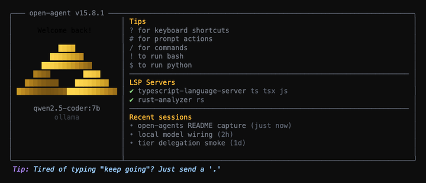

<p align="center">
  <strong>open-agent</strong>
</p>

<p align="center">
  <strong>A fully local-first coding agent. No accounts, no API keys, no phone-home.</strong>
</p>

<p align="center">
  <a href="https://www.typescriptlang.org"></a>
  <a href="https://www.rust-lang.org"></a>
  <a href="https://bun.sh"></a>
</p>

<p align="center">
  
</p>

<p align="center">
  Fork of <a href="https://github.com/can1357/oh-my-pi">oh-my-pi</a> (omp) by <a href="https://github.com/can1357">@can1357</a>, itself a fork of <a href="https://github.com/badlogic/pi-mono">Pi</a> by <a href="https://github.com/mariozechner">@mariozechner</a>.
</p>

<p align="center">
  <a href="docs/README.md"><strong>Documentation hub</strong></a> — architecture, local models, configuration, contributing
</p>

## What this fork is

**open-agent** takes the batteries-included coding harness from [omp / oh-my-pi](https://github.com/can1357/oh-my-pi) and points it in one direction: **run entirely on your own machine.** No cloud providers, no sign-in, no key management, no telemetry. The whole agent talks only to model runtimes you host locally.

This is a goal-driven fork. The sections below describe the **direction** the project is being taken in — not every piece is finished. Where something is a design target rather than a shipped feature, it's framed that way.

### Why

The original Pi is a wonderful, lean terminal-first agent. omp grew it into a capable, full-featured coding surface with 40+ providers and a deep tool set. open-agent keeps the engine, the tools, and the TUI — and strips away everything that assumes a remote API on the other end. The result is meant to be a coding agent you can run on a laptop or a workstation with a local GPU, against models you control, with nothing leaving the box.

The small-model-first philosophy here is directly inspired by [little-coder](https://github.com/mariozechner/little-coder) — the idea that a capable coding agent can be driven primarily by small, fast, local models rather than a single large frontier model. See [Acknowledgements](#acknowledgements).

## The direction

### Local-first: every provider runs on your machine

All cloud provider infrastructure is being removed from the dispatch path. open-agent targets **local model runtimes only**, discovered over their OpenAI-compatible (or native) HTTP endpoints:

| Runtime | Default endpoint | Notes |
| ----------- | ----------------------- | ------------------------------------------------ |
| Ollama | `127.0.0.1:11434` | Native `/api/tags` + `/api/show` enrichment |
| llama.cpp / llama-server | `127.0.0.1:8080` | First-class: open-agent can manage the server lifecycle and load a `.gguf` directly |
| vLLM | `127.0.0.1:8000` | `max_model_len` → context window |
| LM Studio | `127.0.0.1:1234` | OpenAI-compatible |
| LocalAI | `127.0.0.1:8080` | OpenAI drop-in |
| Jan | `127.0.0.1:1337` | Desktop app API |
| llamafile | `127.0.0.1:8080` | Single-file executables |
| TabbyAPI | `127.0.0.1:5000` | ExLlamaV2 |

No API keys are required — every local provider is unauthenticated by default, and unreachable ones are silently skipped during discovery. (`llama.cpp`, `llamafile`, and `localai` all default to port 8080, so only one can bind at a time; configure `baseUrl` to run more than one.)

### A 3-tier model architecture

open-agent replaces the old flat set of model roles (`default`, `smol`, `slow`, `vision`, `plan`, …) with a **3-tier hierarchy** built around the small-model-first idea: a small model drives, and a large model is summoned only for heavy lifting.

| Tier | Size | Role | Tools |
| ------------- | ---------- | --------------------------------------------------------- | ------------------------------------------------ |
| **INTERFACE** | small/fast | Drives the conversation, gathers context, synthesizes | Read-only: `read`, `search`, `find`, `lsp`, `web_search`, `inspect_image`, `task`, `todo_write`, `irc` — **cannot edit** |
| **WORKER** | large | Reasoning, planning, designing, code editing | Full tool access, invoked via delegation |
| **COMPACTOR** | tiny | Context compaction, summarization, message pruning | None — runs invisibly |

The key inversion: **the small interface model is always the one talking to you.** When real work is needed — editing a file, planning a feature, deep reasoning — it delegates to the worker model through the `task` tool and presents the result back. The compactor runs automatically to keep the context window healthy. Write-class tools are gated at the interface tier both by system prompt and by a structural backstop, so the interface model can't accidentally edit even if it tries.

**Vision is a per-model capability, not a role.** Any tier's model can have vision (`input` includes `image`); there is no separate vision role.

System prompts are deliberately minimal — small local models have limited context and degrade with long prompts, so behavior is enforced structurally (tier gates, delegation routing) rather than through lengthy instructions.

## Install

> open-agent is a source-first fork. Clone and run with [Bun](https://bun.sh) (`bun ≥ 1.3.14`).

```sh
git clone https://github.com/ZacharyEllison/open-agents.git open-agents
cd open-agents
bun install
bun run packages/coding-agent/src/cli.ts
```

The binary builds out to `packages/coding-agent/dist/open-agent`.

### Shell completions

`open-agent` generates its own completion scripts for **bash**, **zsh**, and **fish** from live command/flag metadata, so they never drift from the actual CLI. Subcommands, flags, and enum values complete statically; model names resolve against discovered local models and `--resume` against your on-disk sessions.

```sh
# zsh — add to ~/.zshrc (or write the output into a file on your $fpath)
eval "$(open-agent completions zsh)"

# bash — add to ~/.bashrc
eval "$(open-agent completions bash)"

# fish
open-agent completions fish > ~/.config/fish/completions/open-agent.fish
```

## Quick Start

1. Start a local model runtime (e.g. [Ollama](https://ollama.com)):

   ```bash
   ollama serve
   ollama pull llama3.2
   ```

2. Run the agent:

   ```bash
   bun run dev
   ```

3. Type a prompt — the interface model gathers context and delegates to the worker for execution.

For model configuration, see [docs/local-models.md](docs/local-models.md) and [docs/configuration.md](docs/configuration.md).

## Build & Run Locally

### Prerequisites

- **[Bun](https://bun.sh)** `≥ 1.3.14` (`packageManager` in root `package.json`) — runtime, package manager, and test runner
- **[Rust](https://www.rust-lang.org)** — nightly toolchain from [`rust-toolchain.toml`](rust-toolchain.toml) (`rustfmt`, `clippy`) for N-API natives in `crates/`
- **Git** — clone and version control
- **Node.js** — not required for CLI dev; Bun runs TypeScript directly. Needed only if you embed the SDK from a Node host or work on optional Node-native deps (e.g. `onnxruntime-node`)

### Clone and install

```sh
git clone https://github.com/ZacharyEllison/open-agents.git open-agents
cd open-agents
bun install
```

`bun run install:dev` also links `packages/coding-agent` and `packages/ai` into your global Bun path (optional).

### Build

**TypeScript workspaces** (stats client bundle, etc.):

```sh
bun run build
```

Runs `build` in every workspace that defines it (`packages/coding-agent`, `packages/stats`, `packages/natives`).

**Rust natives** (N-API addon consumed by the agent):

```sh
bun run build:native
# or
bun --cwd=packages/natives run build
```

This runs `packages/natives/scripts/build-native.ts` (`cargo` against `crates/pi-natives`). Rebuild natives after changing Rust code; `bun install` does not compile them automatically.

### Run from source

```sh
bun run dev
# equivalent:
bun --cwd=packages/coding-agent src/cli.ts
# or from repo root:
bun packages/coding-agent/src/cli.ts
```

No global install required. The workspace `bin` entry is `open-agent` in `packages/coding-agent/package.json`.

### Check and test

```sh
bun run check    # Biome + tsgo (TS) and clippy/fmt (Rust), in parallel
bun run test     # workspace tests (TS) + `cargo test` (Rust)
```

Package-scoped: `bun --cwd=packages/coding-agent run check` / `run test`.

### Compiled binary

Release-style single executable (Bun `--compile` of `packages/coding-agent/src/cli.ts`):

```sh
bun --cwd=packages/coding-agent run build
```

Runs [`packages/coding-agent/scripts/build-binary.ts`](packages/coding-agent/scripts/build-binary.ts): embeds natives, compiles workers and legacy shim entrypoints, writes **`packages/coding-agent/dist/open-agent`**. On macOS the script ad-hoc-signs the Mach-O binary. Smoke-test the artifact: `bun packages/coding-agent/src/cli.ts --smoke-test` (or run `./packages/coding-agent/dist/open-agent --version`).

## Whatever the task needs, _it's already in the box_.

open-agent keeps omp's deep tool surface — all running locally, in the same namespace as `read` and `bash`. Pin the active set with `--tools read,edit,bash,…` and the rest stay hidden but indexed; `search_tool_bm25` pulls them back in mid-session.

**Files & search**

- `read` — files, dirs, archives, SQLite, PDFs, notebooks, URLs, and internal `://` schemes through one path.
- `write` — create or overwrite a file, archive entry, or SQLite row.
- `edit` — hashline patches with content-hash anchors and stale-anchor recovery.
- `ast_edit` — structural rewrites previewed before apply, via ast-grep.
- `ast_grep` — structural code queries over 50+ tree-sitter grammars.
- `search` — regex over files, globs, and internal URLs.
- `find` — glob-based path lookup; reach for `search` when you need content matches.

**Runtime**

- `bash` — workspace shell, with optional PTY or background-job dispatch.
- `eval` — persistent Python and JavaScript cells with shared prelude and tool re-entry.
- `ssh` — one remote command against a configured host.

**Code intelligence**

- `lsp` — diagnostics, navigation, symbols, renames, code actions, raw requests.
- `debug` — drive a DAP session — breakpoints, stepping, threads, stack, variables.

**Coordination**

- `task` — fan out subagents in parallel, optionally workspace-isolated; the delegation path to the worker tier.
- `irc` — short prose between live agents in this process.
- `todo_write` — ordered mutations over the session todo list with phase tracking.
- `job` — wait on or cancel background jobs.
- `ask` — structured follow-up questions for interactive runs.

**Memory & state**

- `checkpoint` — mark conversation state for a later collapse-and-report.
- `rewind` — prune exploratory context, keep a concise report.
- `retain` / `recall` / `reflect` — durable per-project memory the agent curates.

## Highlights inherited from omp

These capabilities come from the upstream omp harness and carry over to open-agent — now running against local models.

- **Code execution with tool re-entry** — persistent Python and a Bun worker; either kernel can call back into the agent's own tools (`read`, `search`, `task`) over a loopback bridge.
- **LSP wired into every write** — renames go through `workspace/willRenameFiles`, so re-exports, barrel files, and aliased imports update before the file moves.
- **Drives a real debugger** — attach lldb, dlv, or debugpy; step to the bad pointer, walk goroutines, inspect a wedged process.
- **Time-traveling stream rules** — a regex match aborts the stream mid-token, injects a rule as a system reminder, and retries from the same point. Injections survive compaction.
- **First-class subagents** — `task` fans out into isolated worktrees and yields schema-validated results back to the parent.
- **Unapologetically native** — ripgrep, glob, find, and an embedded bash run in-process. The same binary runs on macOS, Linux, and Windows, no WSL bridge.
- **Hashline edits** — the model points at content-hash anchors instead of retyping lines; stale anchors are rejected before they corrupt anything.
- **GitHub / internal schemes as filesystem** — `pr://`, `issue://`, `agent://`, `skill://`, `rule://` and more resolve transparently inside every FS-shaped tool.
- **Conflict resolution by URL** — write `@theirs`, `@ours`, or `@base` to `conflict://N`.
- **Preview, then accept** — `ast_edit` stages a proposed change; `resolve` commits it atomically.
- **Inherits existing config** — reads Cursor MDC, Cline `.clinerules`, Codex `AGENTS.md`, Copilot `applyTo`, and more in their native shape, no migration.

## ~27,000 lines of Rust, doing the work other harnesses shell out for

Three crates, one platform-tagged N-API addon. Search, shell, AST, highlight, PTY, image decode, BPE counting — all in-process on the libuv pool. No fork/exec on the hot path.

- Crates: `pi-natives`, `pi-shell`, `pi-ast`
- Platforms: `linux-x64`, `linux-arm64`, `darwin-x64`, `darwin-arm64`, `win32-x64`

| Module | What it does | Powered by | ~LoC |
| ---------- | ------------------------------------------------------------------------------------ | ----------------------------------------- | ----: |
| shell | Embedded bash · persistent sessions · timeout/abort · custom builtins | brush-shell (vendored) | 3,700 |
| grep | Regex search · parallel/sequential · glob & type filters · fuzzy find | grep-regex · grep-searcher | 1,900 |
| keys | Kitty keyboard protocol with xterm fallback · PHF perfect-hash lookup | phf | 1,490 |
| text | ANSI-aware width · truncation · column slicing · SGR-preserving wrap | unicode-width · segmentation | 1,450 |
| summarize | Tree-sitter structural source summaries with elision controls | tree-sitter · ast-grep-core | 1,040 |
| ast | ast-grep pattern matching and structural rewrites | ast-grep-core | 1,000 |
| fs_cache | Mtime-keyed file cache shared by read · grep · lsp | in-tree | 840 |
| highlight | Syntax highlighting · 11 semantic categories · 30+ aliases | syntect | 470 |
| pty | Native PTY allocation for sudo · ssh interactive prompts | portable-pty | 455 |
| glob | Discovery with glob · type filters · mtime sort · gitignore respect | ignore · globset | 410 |
| workspace | Workspace walker with gitignore + AGENTS.md discovery in one pass | ignore · git2 | 385 |
| image | Decode/encode PNG · JPEG · WebP · GIF · resize with 5 filters | image | 190 |
| tokens | O200k / Cl100k BPE token counting · both tables embedded | tiktoken-rs | 65 |

## Entry points: _interactive_, _one-shot_, RPC, and ACP

Same engine, four wrappers. `open-agent` runs the TUI. `open-agent -p` answers a single prompt and exits. The Node SDK embeds the session in your process. `open-agent --mode rpc` and `open-agent acp` hand the wheel to another program over stdio.

### Interactive — when in doubt, the agent asks

The TUI is the default surface. Tool calls render as cards, edits preview before they land, and ambiguity routes through the `ask` tool — a structured option picker the agent can call mid-turn.

### SDK — embed in Node

Node and TypeScript hosts pull the engine in directly. The package exposes `ModelRegistry`, `SessionManager`, `createAgentSession`, and `discoverAuthStorage`; the session emits typed events you subscribe to.

```ts
import { ModelRegistry, SessionManager, createAgentSession, discoverAuthStorage } from "@open-agents/coding-agent";

const auth = await discoverAuthStorage();
const models = new ModelRegistry(auth);
await models.refresh();

const { session } = await createAgentSession({
	sessionManager: SessionManager.inMemory(),
	authStorage: auth,
	modelRegistry: models,
});
await session.prompt("list .ts files");
```

### RPC — drive over stdio

For non-Node embedders, or when you want process isolation. NDJSON commands in, response and event frames out. `--mode rpc-ui` adds tool cards, selectors, and dialogs as `extension_ui_request` frames the host must answer.

### ACP — speak to editors

The [Agent Client Protocol](https://github.com/zed-industries/agent-client-protocol) over JSON-RPC. When the editor advertises capabilities, tool I/O routes through it and writes are gated by `session/request_permission`.

## Extensibility

An extension is a TypeScript module: same tool API, same slash-command registry, same hotkey table, same TUI primitives the built-ins use. On first run, open-agent inherits whatever is already on disk — rules, skills, and local MCP servers from `.claude`, `.cursor`, `.windsurf`, `.gemini`, `.codex`, `.cline`, `.github/copilot`, and `.vscode`. No migration script.

## Contributing

See [docs/contributing.md](docs/contributing.md) for development setup, conventions, and PR workflow.

For architecture details: [docs/architecture.md](docs/architecture.md).

## Acknowledgements

open-agent stands entirely on the work of others:

- **[Pi](https://github.com/badlogic/pi-mono)** by [Mario Zechner](https://github.com/mariozechner) — the original lean, terminal-first coding agent this whole lineage descends from.
- **[oh-my-pi (omp)](https://github.com/can1357/oh-my-pi)** by [Can Bölük](https://github.com/can1357) — the batteries-included fork of Pi that this fork is built directly on top of. The tool surface, native Rust core, TUI, and harness all come from omp.
- **[little-coder](https://github.com/mariozechner/little-coder)** — inspiration for the small-model-first, local coding agent philosophy that shapes open-agent's 3-tier architecture.

This fork's contribution is a focused one: making the harness fully local-first and reorganizing the model system around small, fast, local models.

---

## Development

`/debug` opens tools for debugging, reporting, and profiling. For architecture and contribution guidelines, see [packages/coding-agent/DEVELOPMENT.md](packages/coding-agent/DEVELOPMENT.md).

## Monorepo Packages

| Package | Description |
| --------------------------------------------------------- | -------------------------------------------------------------------------- |
| **[@open-agents/ai](packages/ai)** | Local-first multi-runtime LLM client with streaming |
| **[@open-agents/agent](packages/agent)** | Agent runtime with tool calling and tiered model state |
| **[@open-agents/coding-agent](packages/coding-agent)** | Interactive coding agent CLI and SDK |
| **[@open-agents/tui](packages/tui)** | Terminal UI library with differential rendering |
| **[@open-agents/natives](packages/natives)** | N-API bindings for grep, shell, image, text, syntax highlighting, and more |
| **[@open-agents/utils](packages/utils)** | Shared utilities (logging, streams, dirs/env/process helpers) |

### Rust Crates

| Crate | Description |
| ------------------------------------------------------------- | --------------------------------------------------------------------------------------------------- |
| **[pi-natives](crates/pi-natives)** | Core Rust native addon (N-API `cdylib`); aggregates the crates below |
| **[pi-shell](crates/pi-shell)** | Embedded shell / PTY / process management (wraps `brush-*`) |
| **[pi-ast](crates/pi-ast)** | tree-sitter-based code summarizer and AST utilities (50+ language grammars) |
| **[pi-iso](crates/pi-iso)** | Task isolation backend resolver: APFS clones, btrfs/zfs reflinks, overlayfs, projfs, rcopy |
| **[brush-core-vendored](crates/brush-core-vendored)** | Vendored fork of [brush-shell](https://github.com/reubeno/brush) for embedded bash execution |
| **[brush-builtins-vendored](crates/brush-builtins-vendored)** | Vendored bash builtins (cd, echo, test, printf, read, export, etc.) |

---

## License

MIT. See [LICENSE](LICENSE).

© 2025 Mario Zechner  
© 2025-2026 Can Bölük  
open-agent fork © 2026

_made for terminals that stay open_
